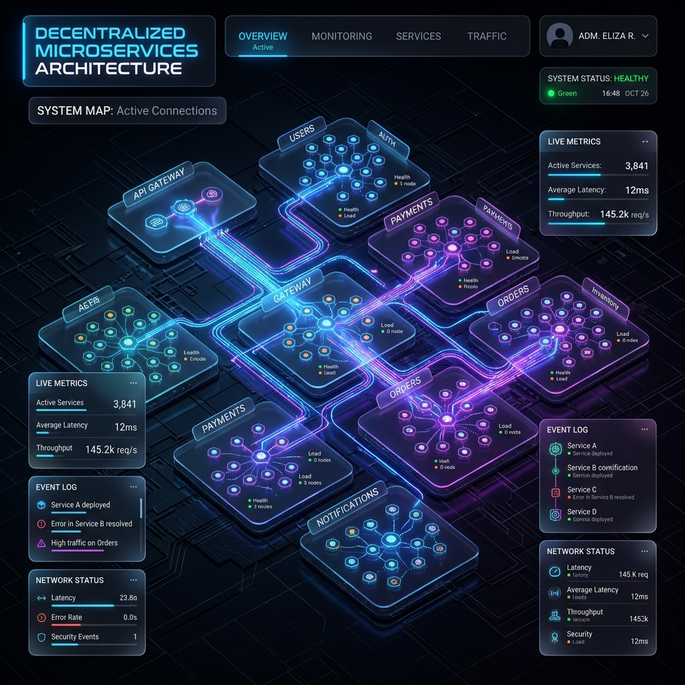

# 🚀 Système E-Commerce Intégré - Architecture Microservices



> Une plateforme e-commerce robuste et scalable, fruit d'une intégration globale de services spécialisés (Commandes, Produits, Stocks, Utilisateurs).

---

## 🏛️ Architecture du Projet

Ce dépôt contient la configuration d'orchestration **Docker Compose** et les **Configurations centralisées** pour l'ensemble de l'écosystème.

### 🧩 Écosystème des Services

| Service | Responsabilité | Développeur |
| :--- | :--- | :--- |
| **`gateway-service`** | Point d'entrée unique, Routage & Sécurité | **Eya Hermi** |
| **`commande-service`** | Gestion du cycle de vie des commandes | **Eya Hermi** |
| **`product-service`** | Catalogue produits & Recherche | **Mohamed Seddik Hafidh** |
| **`stock-service`** | Gestion des inventaires & Alertes | **Mohamed Seddik Hafidh** |
| **`user-service`** | Gestion des profils utilisateurs | **Fatma Sboui** |
| **`eureka-server`** | Annuaire de services (Discovery) | *Infrastructure* |
| **`config-service`** | Serveur de configuration centralisé | *Infrastructure* |

---

## 🛠️ Stack Technique

- **Backend**: Spring Boot 3.x, Spring Cloud (Gateway, Eureka, Config)
- **Sécurité**: Keycloak (OAuth2, JWT)
- **Message Broker**: Apache Kafka (pour la synchronisation Product/Stock)
- **Base de données**: MySQL 8.0
- **Orchestration**: Docker & Docker Compose

---

## 🚀 Démarrage Rapide

### 1️⃣ Prérequis
- Docker Desktop installé
- Les images Docker doivent être accessibles sur Docker Hub

### 2️⃣ Lancement de l'infrastructure
```bash
docker-compose up -d
```

### 3️⃣ Accès aux Services
- **Eureka Dashboard**: [http://localhost:8761](http://localhost:8761)
- **Keycloak Console**: [http://localhost:8080](http://localhost:8080) (Admin/Admin)
- **API Gateway**: [http://localhost:8085](http://localhost:8085)
- **Config Server**: [http://localhost:8888](http://localhost:8888)

---

## 📡 Routage API (Gateway)

| Service | Prefixe de Route | Endpoint Externe |
| :--- | :--- | :--- |
| **Commandes** | `/api/commandes/**` | `http://localhost:8085/api/commandes` |
| **Produits** | `/api/products/**` | `http://localhost:8085/api/products` |
| **Stocks** | `/api/stocks/**` | `http://localhost:8085/api/stocks` |
| **Users** | `/api/users/**` | `http://localhost:8085/api/users` |

---

## 🔐 Configuration Sécurité (Keycloak)
Le système utilise le Realm **`ecommerce`**.
Assurez-vous d'importer le fichier de configuration Keycloak (si fourni) ou de créer les rôles `user` et `admin` pour tester les accès sécurisés sur le Gateway.

---

## 👥 Équipe de Développement
- **Eya Hermi**
- **Mohamed Seddik Hafidh**
- **Fatma Sboui**

---
*Projet réalisé dans le cadre du module Systèmes Distribués.*
